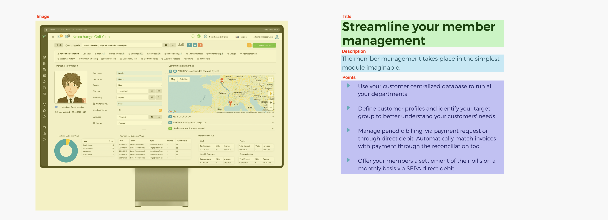

# Updating languages

## General translations

The general translations can be found in the files in `_data/i18n` (i.e. `_data/i18n/en.yml`), these files have the same structure for all languages and are separated in various blocks.

|   |   |
|:- | - |
| `site` | These are the site-wide translations, such as the title of the site and the SEO description
| `global` | These are translations that are used on almost all pages, such as the title for the contact form, and the labels for pricing and feature buttons
| `contact` | Here you will find the translations for the contact form. Each field has a `label` and a helptext (`help`). Also the success and error messages can be translated here.
| `mainMenu` | These are the labels shown in the top navigation bar. Each link has their own translation, and can so be changed.
| `footer` | Here are the translations for the links and other text shown in the footer, such as the brochure links and the copyright.
| `home` | These are the translations for the landing- or homepage.
| `blocks` | Here are titles for various blocks that are used in the site, such as the FAQ and the `What can Nexxchange do for you` block that is present under each page.
| `pages` | Here every page has their own translations, as denoted by the key for these translations. For example, the `Golf Multi Site` page has its translations under the `golfMultiSite` key. (See [Page translations](#page-translations))

See also the comments (lines starting with a `#` sign) for more information in these files.

## Page translations

Page translations are split up into two parts, the general information such as title and the information block at the top, and the blocks that are the actual content of the page.
The general information can be found in the `pages` section of the general translations (See [General translations](#general-translations)) and are fairly simple.

|   |   |
|:- | - |
| `title` | The title of the page, this will also be shown in the title of the browser window
| `headerTitle` | The title of the information block. See the below screenshot.
| `headerSubtitle` | The subtitle of the information block. See the below screenshot.

Example:

```yml
members:
  title: Member Golf
  headerTitle: Offer your members<br> the best experience
  headerSubtitle: Nexxchange can help you provide your members with the best service
```


> **Warning** This block must exist for every page and must have the same key as the content blocks directory and the `title:` element of the [Frontmatter](#frontmatter).

The content blocks can be found in the `_data/blocks` directory. Each page that uses these blocks has their own directory in each of the language directories.
These blocks are then shown sorted by filename in the page.

Each block is a `.yml` file that has the following information (See also the screenshot below):

|   |   |
|:- | - |
| `title` | The title of the block
| `image` | The image that should be shown on the side of the block
| `description` | The text that is shown under the title
| `points` | This is the listing of benefits or other information that is shown under the description

Example:

```yml
title: Streamline your member management
image: image3
description: >-
  The member management takes place in the simplest module imaginable.
points:
  - Use your customer centralized database to run all your departments
  - Define customer profiles and identify your target group to better understand your customers' needs
  - Manage periodic billing, via payment request or through direct debit. Automatically match invoices with payment through the reconciliation tool.
  - Offer your members a settlement of their bills on a monthly basis via SEPA direct debit
```



> For an overview of the images, see [below](#images)

# Adding B2B Pages

To add a new B2B page, a `.html` file needs to be added to every directory in the `/pages` directory (i.e. `en` and `de`).

Each page contains two parts, the frontmatter and the content. The frontmatter is the part between the 3 dashes (`---`), the content comes after the last 3 dashes.

> ### Frontmatter
>
> This is the information that the page needs to be shown properly  
>
> This has the following information:
>
>  |  | |
>  |:-|-|
>  | `id` | The identifier of the page, this is usually the language code followed by a dash (`-`) and the filename without the `.html` part (i.e. `en-accounting`)
>  | `title` | This is the key for the translated title (see [Page translations](#page-translations)), i.e. `accounting`. **One note about the title**: If the title contains spaces (such as `"Golf Multi Site"`), the spaces must be removed, and the words capitalized, for example: `golfMultiSite`.
>  | `lang` | This is the language code for the page, i.e. `en` for English
>  | `permalink` | This is the url for the page itself, i.e. `/en/accounting/`. This should always start with a slash (`/`) followed by the language code and another slash. 
>  | `layout` | This is the layout that is used for this page, this is `default-en` for English, and `default-de` for German.
>  | `navbarClass` | This changes the color of the navigation bar at the top of the page. This value should not be changed


Follow the following steps (example: English, page: Accounting):

1. Copy the `/pages/.skel.html` file to the `/pages/en/` directory
2. Rename the `/pages/en/.skel.html` file to `accounting.html`
3. Open the `/pages/en/accounting.html` file
4. Replace all instances of `[lang]` in the frontmatter for the language code: `en`
5. Fill in the title with `accounting`
5. You are done, you can now start adding [content blocks](#page-translations)!

This will result in the following frontmatter:

```yml
---
# page information
id: en-accounting
title: accounting
lang: en

# url
permalink: /en/accounting/

# settings
layout: default-en
navbarClass: stick
---
```


# Updating B2B Pages

> First, solve the problem. Then, write the code.  
> -- John Johnson

## Product pages

Product pages are divided into blocks that are placed underneath each other, grouped in the `_data/products/[language]` directory. Here you find a directory for each page (i.e. `greenfee` for the `greenfee.html` page). These blocks can be updated (or added) to change the text on the page. The number in front of the filename manages the order of the blocks on the page.

### Example:

```yml
# 2-stay-in-touch-with-your-customers.yml

title: Stay in touch with your customers
image: image4
description: >-
  Organizing your customer database and communicating adequately and frequently enough is the key to growing your business.
points:
  - Carry out marketing campaigns and conduct bulk mailings
  - Use our e-mail template or build your own to better catch your customers' attention
  - Control partnerships with hotels or companies and send automated monthly statements
  - Create online deals for your golfers and visitors and increase your revenues

```

This results in the following block:


# Install

> Any fool can write code that a computer can understand. Good programmers write code that humans can understand.  
> -- Martin Fowler

```
bundle install
```

# Run

```
bundle exec jekyll serve --safe
```

# Notes

Use the `--safe` parameter! This ensures that it will run on Github Pages as well.


# Images

