# B2B Nexxchange

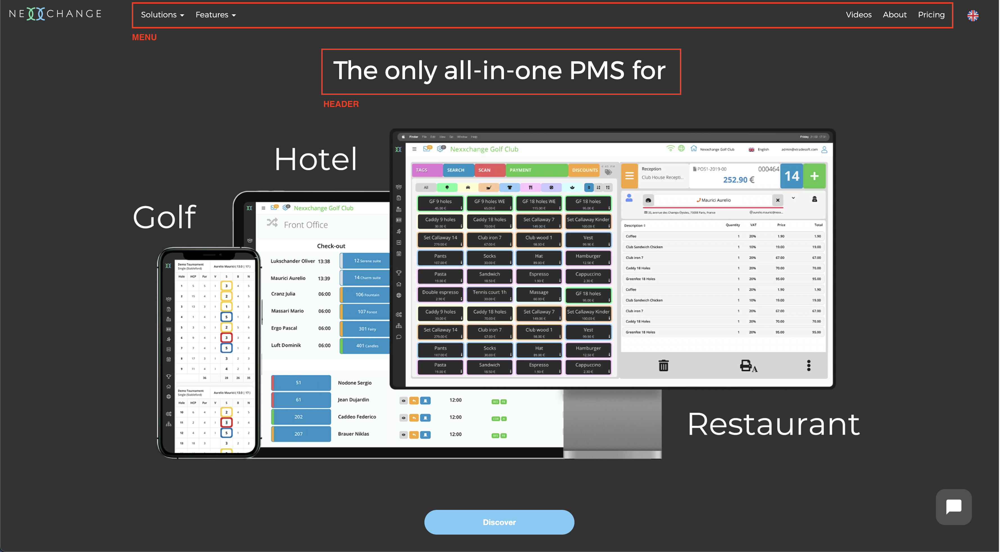

**MENU**: See [menu](#menu)  
**HEADER**: See [header](#header)

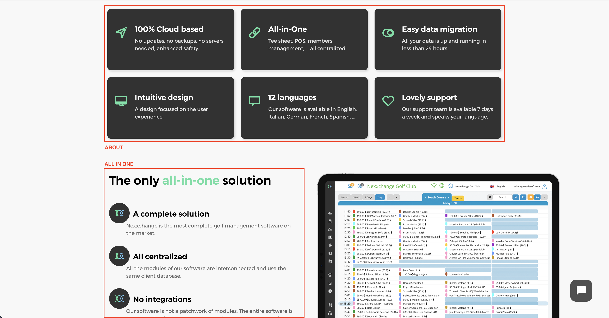

**ABOUT**: See [about](#about)  
**ALL IN ONE**: See [homepage blocks](#homepage-blocks) (same for Room rates and features)

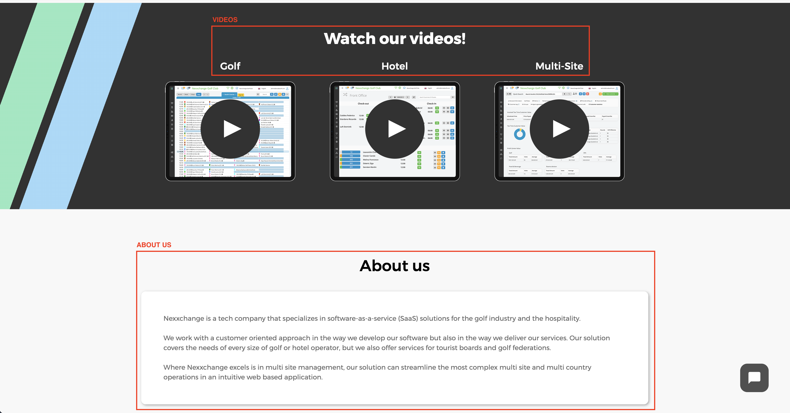

**VIDEOS**: See [common buttons](#common-buttons-and-titles)  
**ABOUT US**: See [homepage blocks](#homepage-blocks)

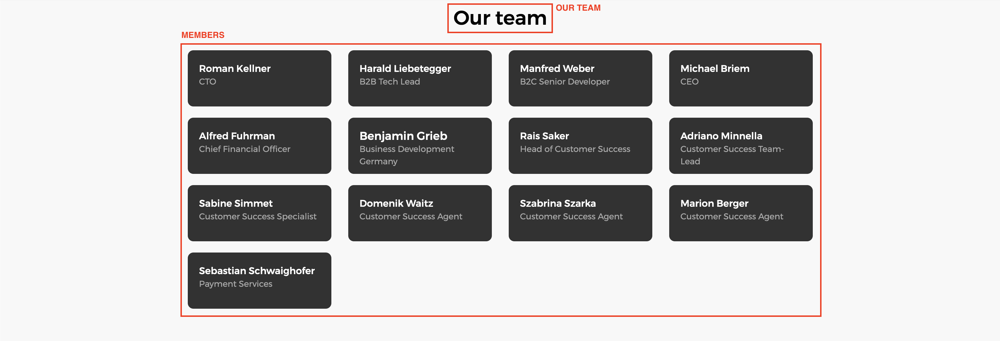

**OUR TEAM**: See [our team](#our-team)  
**MEMBERS**: See [members](#members)

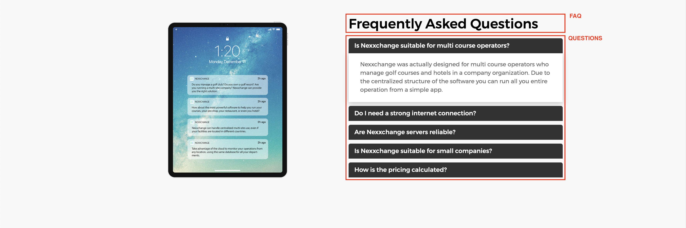

**FAQ**: See [homepage blocks](#homepage-blocks)  
**QUESTIONS**: See [questions](#questions)

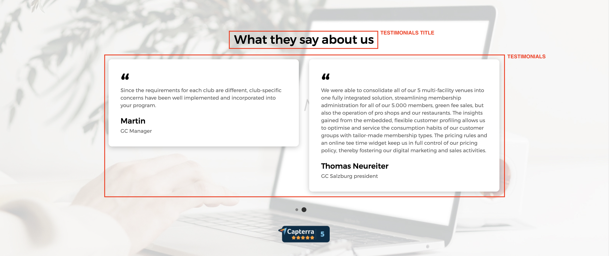

**TESTIMONIALS TITLE**: See [homepage blocks](#homepage-blocks)  
**TESTIMONIALS**: See [testimonials](#testimonials)

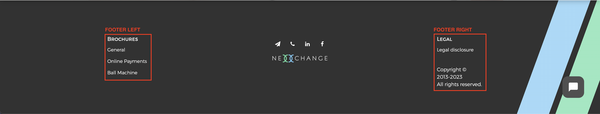

**FOOTER LEFT**: See [footer left](#footer-left)  
**FOOTER RIGHT**: See [footer right](#footer-right)

## Menu

| | |
| -:| - |
| File | `_data/i18n/[lang].yml` |
| Section | `mainMenu` |


## Header

| | |
| -:| - |
| File | `_data/homePage/[lang].yml` |
| Section | `header` |

The title and button below the banner video can be changed in this section

## About

| | |
| -:| - |
| File | `_data/homePage/about/[lang].yml` |
| Section | - |

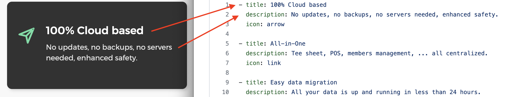

Each item (starting with a `-`) is a block. Only 6 icons are available, see the below list.

- arrow
- link
- switch
- screen
- chat-box
- heart

## Homepage blocks

| | |
| -:| - |
| File | `_data/homePage/[lang].yml` |
| Section | `allInOne` |
| Section | `roomManagement` |
| Section | `features` |
| Section | `aboutUs` |
| Section | `ourTeam` |
| Section | `faq` |
| Section | `testimonials` |

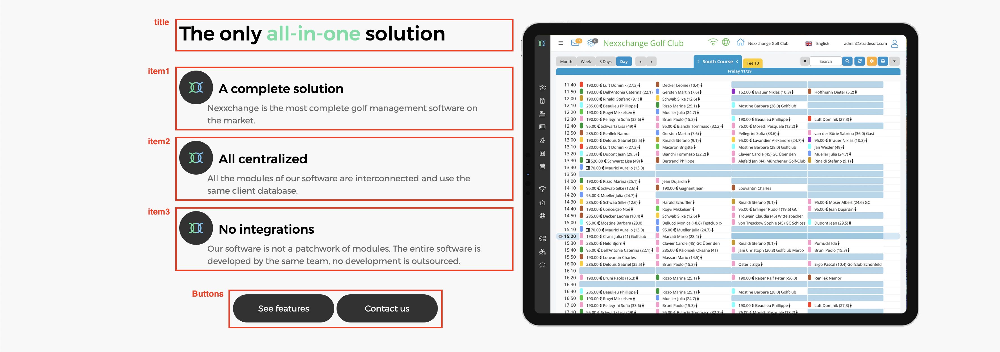

Each section contains a title and a description (the "Our Team", "FAQ" and "Testimonials" blocks do not have a description), these can be changed here.

For changing the buttons, see [common buttons](#common-buttons)

## Our Team

| | |
| -:| - |
| File | `_data/homePage/[lang].yml` |
| Section | `ourTeam` |

Only the title can be changed here. For changing the team members, see [below](#members).

## Members

| | |
| -:| - |
| File | `_data/homePage/team/members.yml` |
| Section | - |

Each team member (starting with a `-`) becomes their own block. Team members have two fields that are required:

| Key | Description |
|:--- | ----------- |
| `name` | The name of the team member
| `function` | The role or function of the team member

Furthermore a team member can have a `contact` field (see the example below) with the contact details. It is optional to have this `contact` field.

| Key | Description |
|:--- | ----------- |
| `phone` | The phonenumber on which this team member can be reached
| `email` | The email address where this team member can be reached. Additional parameters such as the email subject (`subject=`) and CC address (`cc=`) can be added here as well, after a `?` and separated by `&`.
| `linkedin` | The linkedin profile of this team member

<details>
  <summary>Example <strong>team member without contact details</strong></summary>

```yml
- name: Roberto Examplar
  function: Example Team Member
```
</details>

<details>
  <summary>Example <strong>team member with contact details</strong></summary>

```yml
- name: Roberto Examplar
  function: Example Team Member
  contact:
    phone: +31123456789
    email: roberto.examplar@nexxchange.com
    linkedin: https://linkedin.com/roberto-examplar/
```
</details>

## Questions

| | |
| -:| - |
| File | `_data/homePage/faq/[lang].yml` |
| Section | - |


Each FAQ item (starting with a `-`) has a title (`question`) and a description (`answer`). These can be changed here, and new FAQ items can be added in the same structure. 

> **Warning** Only use simple text and line breaks are ignored.

## Testimonials

| | |
| -:| - |
| File | `_data/homePage/testimonials/[lang].yml` |
| Section | - |

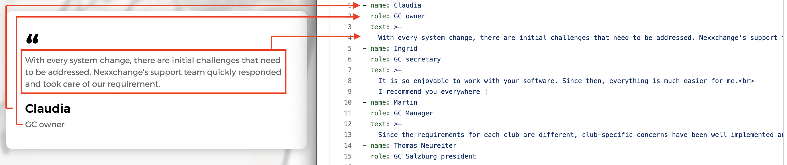

Each testimonal (or review, starting with a `-`) has the following information.

| Key | Description |
|:--- |:----------- |
| `name` | The name of the person who made the testimonial
| `role` | The role of the person who made the testimonial
| `text` | The text of the testimonial. 

> **Warning** PLease only use simple text, line breaks are ignored

## Footer Left

| | |
| -:| - |
| File | `_data/i18n/[lang].yml` |
| Section | `footer` ↳ `brochures` |

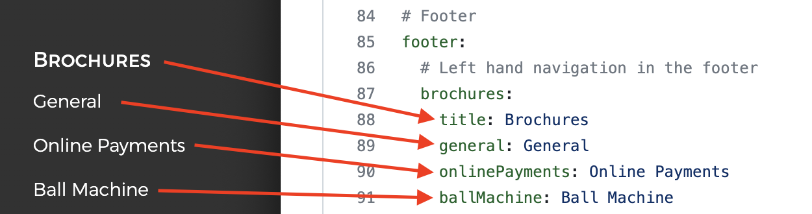

## Footer Right

| | |
| -:| - |
| File | `_data/i18n/[lang].yml` |
| Section | `footer` ↳ `legal` |

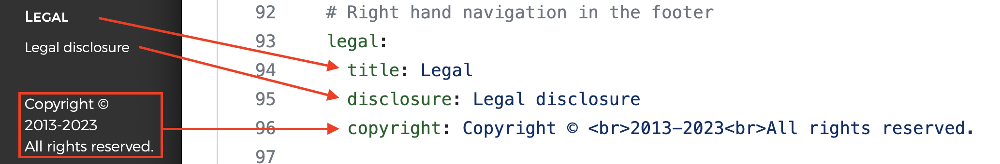

## Common buttons and titles

| | |
| -:| - |
| File | `_data/i18n/[lang].yml` |
| Section | `global` |

The labels of buttons and some titles can be changed here.

| Key | Description |
|:--- |:----------- |
| `contactUs` | The label for the "Contact Us" button
| `seePricing` | The label for the "See pricing" button
| `seeFeatures` | The label for the "See features" button
| `whatCanWeDo` | The title of the "Find out what Nexxchange can do for you" block at the end of each content page
| `watchOurVideos` | The title for the "Watch our videos!" block
| `golf` | Title of the golf teaser video
| `hotel` | Title of the hotel teaser video
| `multiSite` | Title of the multi-site teaser video
| `select` | The label of the "Select" button on the Pricing page
| `call` | The label of the "Call" button to call a team member
| `sendMail` | The label for the "Send Mail" button to mail a team member
